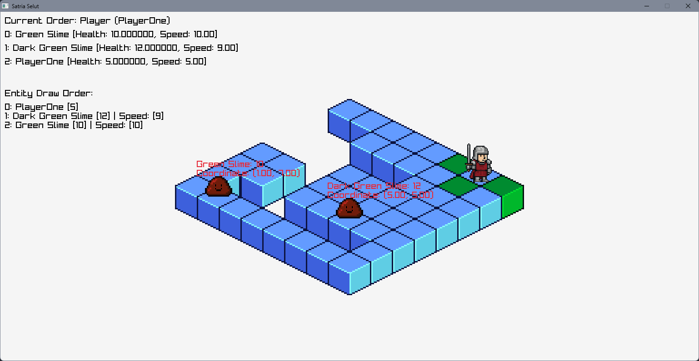

# Satria Selut: Mula

A 2D grid-turn-based game built in C++ using Raylib. The project is still ongoing. 

## About
Essentially, this project would be a 'sequel' of the [Satria Selut](https://cringedo.itch.io/satria-selut) in itch.io.

## Current Progress
- Created a GameManager that initializes the gameplay, loads data for the monsters.
- Implemented the grid generator that generates based on the noise created via FastNoiseLite library. 
- Implemented hardcoded simple algo for the Monsters to *catch* the player by comparing with the coordination of the player.

## Requirement
-  C++ compiler (g++) in PATH
- make/mingw32-make
- git (for submodules)

## To Run
1. `make setup` to get the submodules and dependencies.
2. `make` to build and run the game.

